# 少儿汉语教学测试

## 颜色

### 1框0图无
白色。

### 1框0图音
学红色。

### 1框0图视
看动画。

### 1框1图无
苹果。

### 1框1图音
学蓝色。

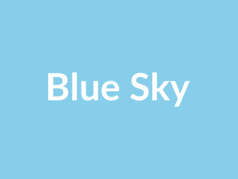

### 1框2图无
花朵。

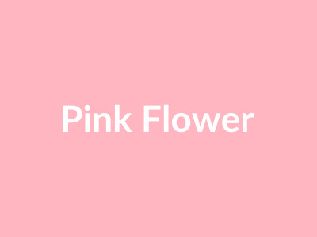
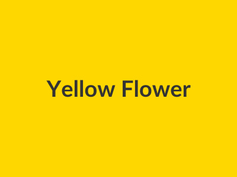

### 1框2图音
学绿色。

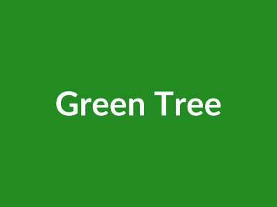

### 1框3图无
白云。

### 1框3图音
学黄色。

### 1框4图无
汽车。

### 1框4图音
学黑色。

### 1框5图无
水果。

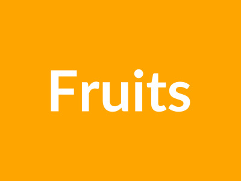
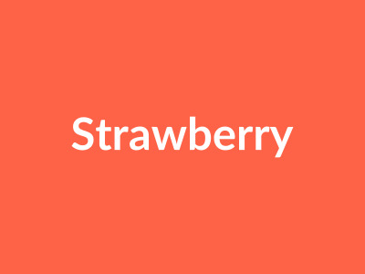
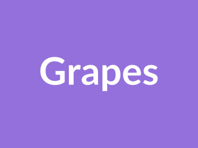
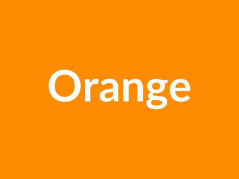
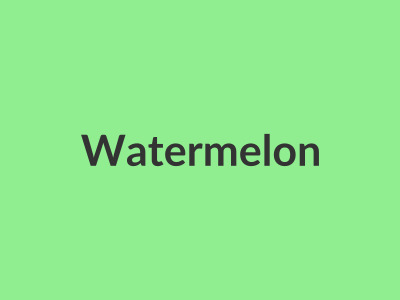

### 1框5图音
学白色。

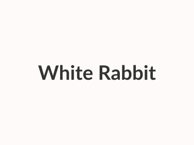

## 数字

### 2框0图无
一二三。||四五六。

### 2框0图音
学数字。||

### 2框0图视
看动画。||

### 2框1图无
一个。||两个。

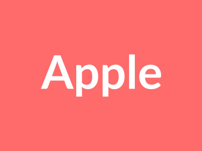

### 2框1图音
学加法。||

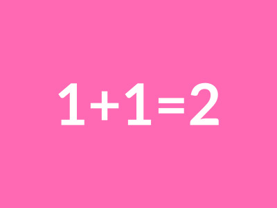

### 2框2图无
苹果。||香蕉。

### 2框2图音
学减法。||

### 2框4图无
小猫喵喵。||小狗汪汪。

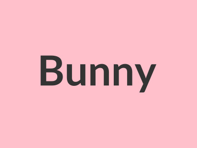
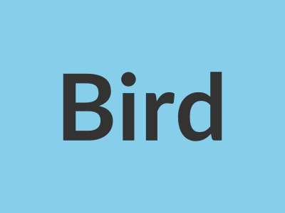

### 2框4图音
学数数。||

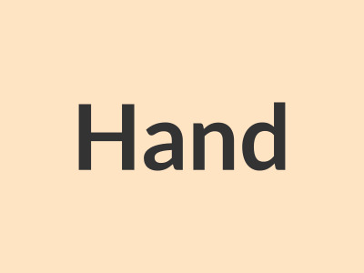

## 动物

### 3框3图无
小猫喵喵。||小猫爱吃鱼。||小猫很可爱。

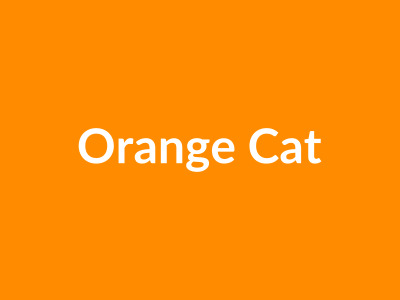
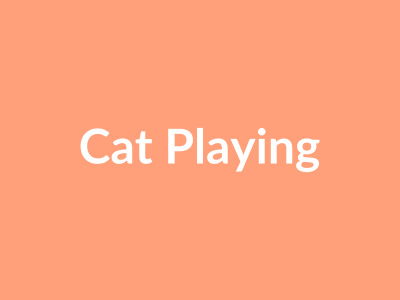
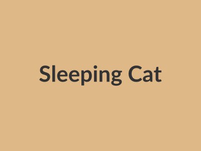

### 3框3图音
学动物。||

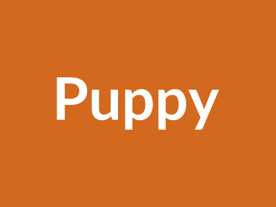

### 4框1图无
红色。||黄色。||蓝色。||绿色。

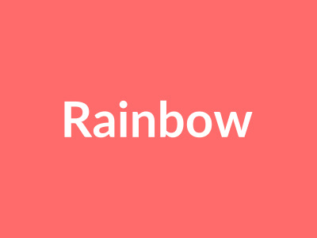

### 4框1图音
学颜色。||

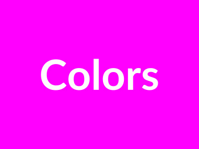

### 4框4图无
天空蓝色。||大海蓝色。||草地绿色。||花红色。||太阳黄色。||白云白色。||黑夜黑色。||彩虹七色。||树叶绿色。||雪花白色。

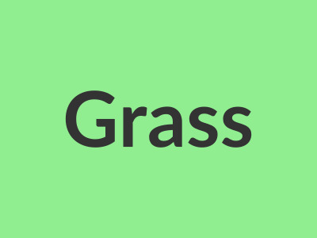
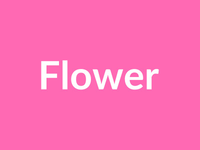

### 4框4图音
学汉字。||

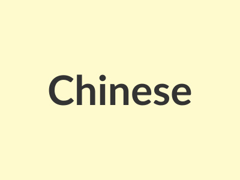

## 总结

### 总结
今天学的真多。||颜色数字动物。||谢谢老师！

### 再见
明天见。||再见！

